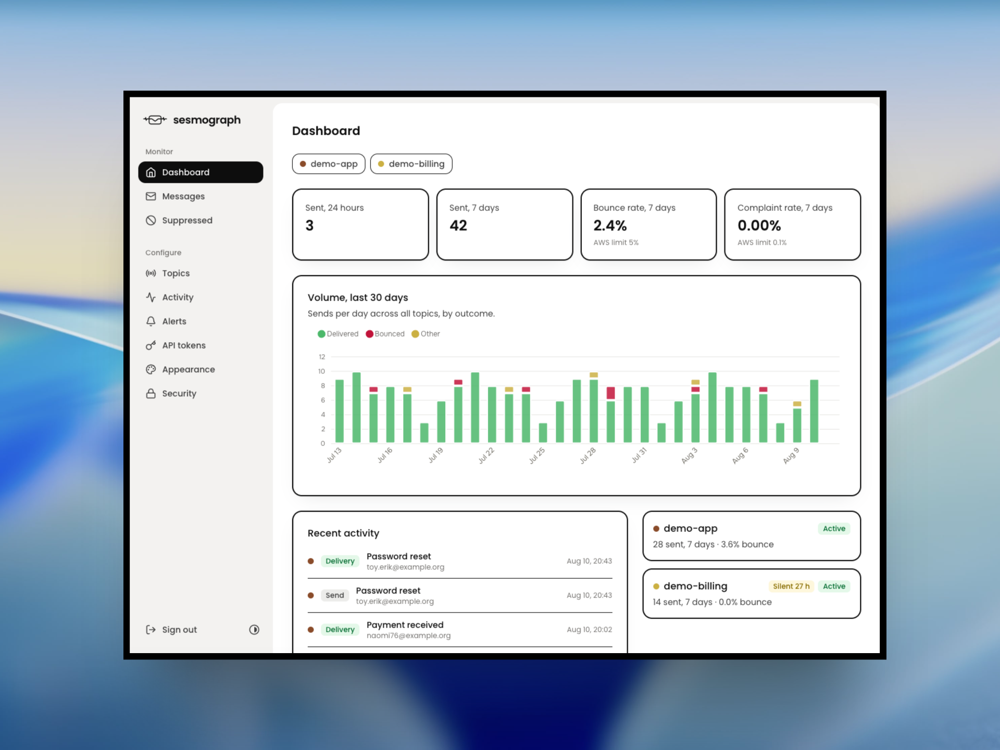
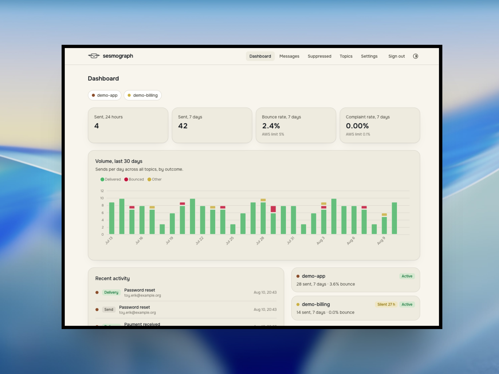

# sesmograph

Self-hosted email observability for Amazon SES. Point your SNS topics at it
and get dashboards, searchable message timelines, alerts and a suppression
list - on plain PHP hosting, with **no AWS credentials** stored anywhere.



## What it does

- **Topics** - one per app or service, each with its own secret webhook URL.
  SNS signatures are verified, subscriptions confirm automatically, and the
  first signed delivery pins the topic's ARN so a leaked URL cannot be fed
  forged events.
- **Dashboards** - sending volume, bounce and complaint rates against the
  AWS limits, event-type breakdown and recent activity, built from daily
  aggregates so they stay fast at any volume.
- **Messages** - full-text search and a per-message event timeline with SMTP
  bounce diagnostics; message bodies can optionally be ingested via the API.
- **Alerts** - SMTP, Telegram, Pushover or signed-webhook channels; rules
  fire immediately on hard bounces and complaints, on bounce/complaint rate
  thresholds, or when an active topic goes silent.
- **Suppression list** - built automatically from hard bounces and
  complaints, with CSV export and an address-check endpoint for your app.
- **Read-only REST API + MCP server** - the same Bearer tokens serve uptime
  monitors and AI assistants; see [docs/api.md](docs/api.md).
- **Single admin, TOTP 2FA mandatory** - the account is created from the
  CLI; there is no registration to lock down.

Two switchable themes ship out of the box - Mono (black on white) and Hum
(cream and mint):



## How it works

AWS pushes, sesmograph listens - it never calls AWS APIs on your behalf:

```
your app --(SES send)--> Amazon SES --> SNS topic --HTTPS--> /webhooks/{token}
```

Raw events are kept 30 days by default (configurable per topic); daily
aggregates are kept forever. Details in
[docs/architecture.md](docs/architecture.md).

## Requirements

- PHP 8.3+, MySQL 8 / MariaDB 10.6+ or SQLite
- HTTPS with a valid certificate (SNS only delivers to HTTPS endpoints)
- Cron - no Docker, no Redis, no queue daemon

A small VPS or a decent shared host is enough. Step-by-step instructions,
including the AWS side: [INSTALL.md](INSTALL.md).

## Documentation

- [INSTALL.md](INSTALL.md) - installation, from server to first event
- [UPGRADE.md](UPGRADE.md) - upgrading between releases
- [docs/architecture.md](docs/architecture.md) - how the pieces fit together
- [docs/alerts.md](docs/alerts.md) - alert channels and rules
- [docs/api.md](docs/api.md) - REST API and MCP server
- [docs/troubleshooting.md](docs/troubleshooting.md) - when events don't show up
- [CONTRIBUTING.md](CONTRIBUTING.md) - development setup and project boundaries
- [SECURITY.md](SECURITY.md) - reporting vulnerabilities

## Acknowledgements

sesmograph is inspired by [Sessy](https://github.com/marckohlbrugge/sessy)
by Marc Köhlbrugge, which pioneered the idea of a small, self-hosted SES
observability tool. sesmograph is an independent reimplementation in
PHP/Laravel aimed at plain shared hosting; it shares the spirit, not the
code, and is not affiliated with the Sessy project.

## Support

sesmograph is free and maintained in spare time. If it saves you time, you
can [buy me a coffee](https://buymeacoffee.com/sqlik).

## License

[O'Saasy](LICENSE.md) - free to self-host, modify and use commercially; the
only restriction is offering sesmograph itself as a competing hosted/SaaS
product. Bundled fonts (Onest, Poppins) are under the SIL Open Font License.
